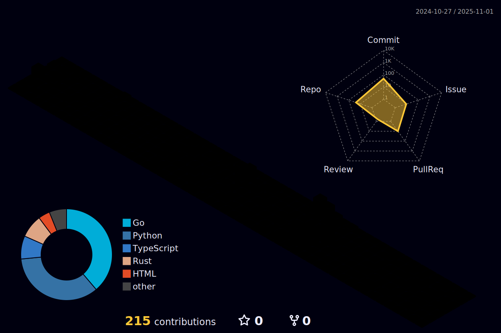

<h1 align="center">Hi 👋, I'm Shemol</h1>

- 🔭 I’m currently **preparing for the Graduate Entrance Exam**
- 🌱 I’m currently learning **basic cs knowdge**
- 📝 I regularly write articles on [https://SherlockShemol.github.io/](https://SherlockShemol.github.io/)
- 👨‍💻 All of my projects are available at 

- 💬 I believe in Optimistic go luck
- 📫 How to reach me **shemol106@gmail.com**

## 🤝 Connect With Me
 &nbsp;&nbsp;
 

## 🧠 The body perishable, but the mind eternal

## 📊 Github Stats 

